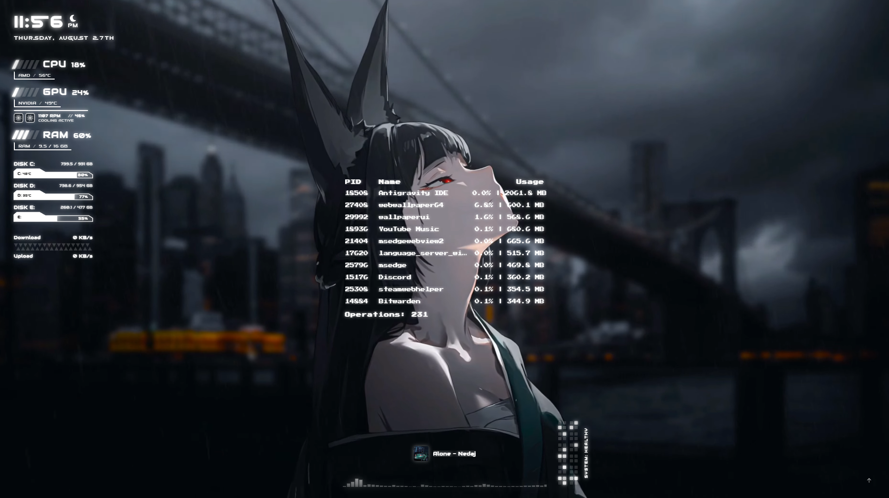
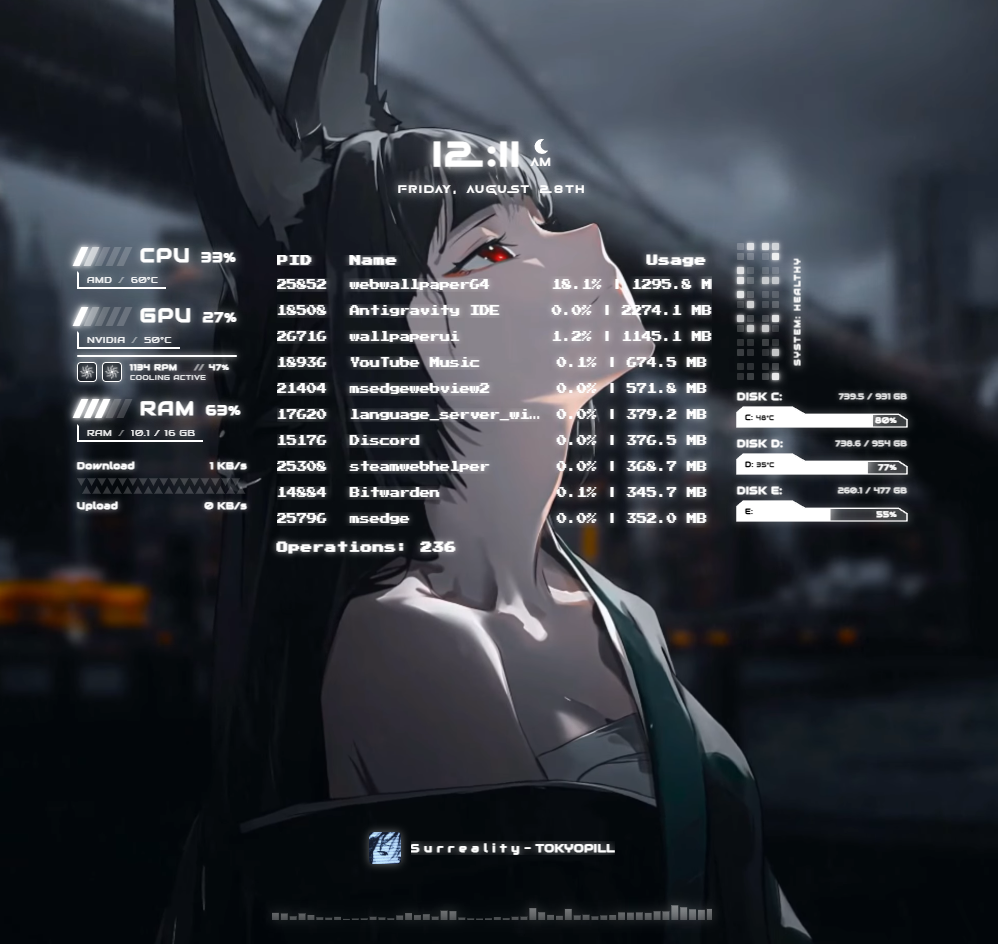

# Wallux V2.0

> **Futuristic Sci-Fi HUD for Wallpaper Engine with Real-Time Hardware Telemetry, Audio Visualization, and Dynamic Module Deployment.**

Wallux V2.0 transforms your desktop into an interactive sci-fi command console, delivering live telemetry from [Nekoframe](https://github.com/nubsuki/Nekoframe), animated neon tube-light power-on sequences, dynamic 2K/4K scaling, and an integrated audio visualizer.

---

## Previews

  
  
<em>▶️ Watch the Video Showcase on YouTube</em>

  
  
<em>Operational Deployed Layout (Clock, Metrics Stack, Disks, Network & Audio Visualizer)</em>

  
  
<em>Centered Command Console Layout with Process Monitor & Diagnostic Matrix</em>

---

## Key Features

### Real-Time Hardware Telemetry (via Nekoframe)

- **Mecha CPU / GPU / RAM Banners**: Live usage percentages, hardware chip model badges, and temperature monitors.
- **Cooling & Fan Monitor**: Live fan RPM, duty cycle percentage, and animated dual spinning fan blades that react to cooling activity.
- **Stepped Storage Modules**: Up to 3 drive partitions (`C:`, `D:`, `E:`) with inline temperature badges, used/total capacity, and stepped SVG progress tracks.
- **Dual-Bandwidth Network Widget**: Real-time Download and Upload speed trackers with signal wave animations.
- **LED Telemetry Matrix & Diagnostic Health**: 2x2 sub-quad LED telemetry matrix with pulsating scanners and global high-temperature warning alerts.
- **Interactive Process Manager**: Live top-process table with a clean bottom-right toggle button to show/hide on demand.

### Cinematic Boot & Dynamic Deployment

- **Hazard Boot Screen**: Loading screen with connection status feedback.
- **Tube-Light Neon Ignition**: Staggered incandescent power-surge flickers across all HUD modules.
- **Sequential Deployment Wave**: Modules smoothly glide from central calibration into their operational layout positions.

### Pure Neon Audio Visualizer

- **Spectrum Analyzer**: 64-band glowing white audio visualizer with smooth decay physics.
- **Now Playing Metadata**: Live track title, artist info, and album artwork integration.

### Dynamic Display Resolution Scaling (1080p / 2K / 4K / Ultrawide)

- **Resolution-Independent**: Proportional auto-scaling across Full HD (`1080p`), 2K (`1440p`), 4K (`2160p`), and Ultrawide (`21:9` & `32:9`) displays.
- **Native Vector Sharpness**: All typography, SVG stepped bars, and telemetry matrices remain razor-sharp at high DPI.

### Interactive Parallax

- Subtle mouse-tracking depth on the background video.

---

## Wallpaper Engine Settings

Wallux V2.0 includes native **Wallpaper Engine** customization properties:

| Property                                | Type                | Description                                                                                                          |
| :-------------------------------------- | :------------------ | :------------------------------------------------------------------------------------------------------------------- |
| **`Background Video (.webm only)`**     | File                | Select a custom `.webm` background video. _(Note: CEF runtime natively supports open-source WebM)._                  |
| **`Animate HUD Movement / Deployment`** | Boolean (Toggle)    | **Enabled:** Modules glide to the corners on boot.  **Disabled:** Modules remain in their clean, centered layout. |
| **`Audio Visualizer Sensitivity`**      | Slider (1.0 - 10.0) | Tune the responsiveness and height amplification of the audio visualizer bars.                                       |
| **`Background Blur`**                   | Slider              | Adjust background video blur intensity.                                                                              |

---

## Installation & Quick Start

1. **Install Nekoframe**:
   - Download the latest release from the [Nekoframe Releases](https://github.com/nubsuki/Nekoframe/releases) page.
   - Run Nekoframe (it will sit quietly in your system tray).
2. **Download Wallux**:
   - Subscribe on Wallpaper Engine Workshop: [Wallux on Steam](https://steamcommunity.com/sharedfiles/filedetails/?id=3453056882) or load the project folder into Wallpaper Engine.
3. **Launch**:
   - Apply Wallux in Wallpaper Engine. Wallux will automatically establish a local WebSocket connection (`ws://localhost:3069/ws`) with Nekoframe and start streaming live metrics.

---

## Credits

- Background Video: [Moewalls](https://moewalls.com/)
- Hardware Telemetry Engine: [Nekoframe](https://github.com/nubsuki/Nekoframe)

---

## License

This project is for personal use and is distributed "as-is".use at your own risk.
